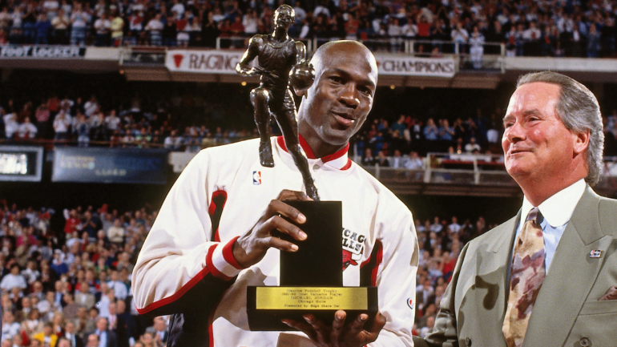
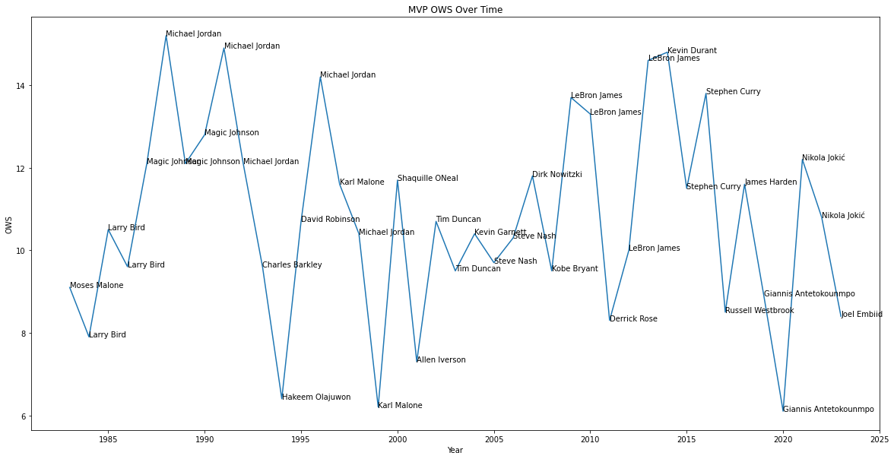
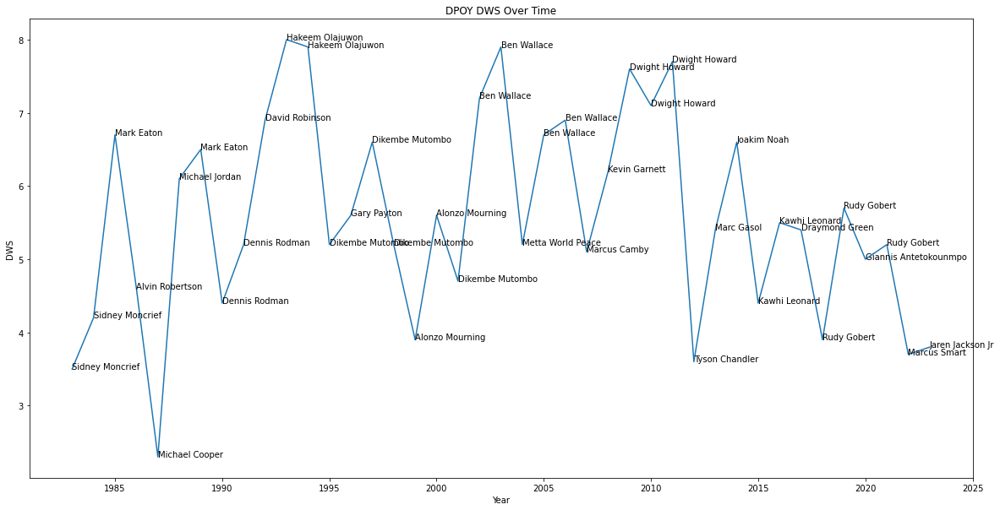
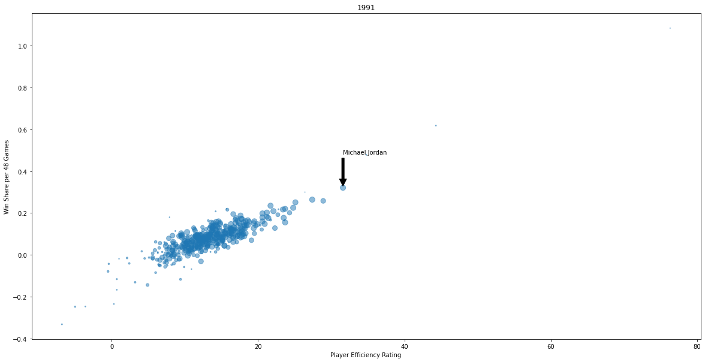
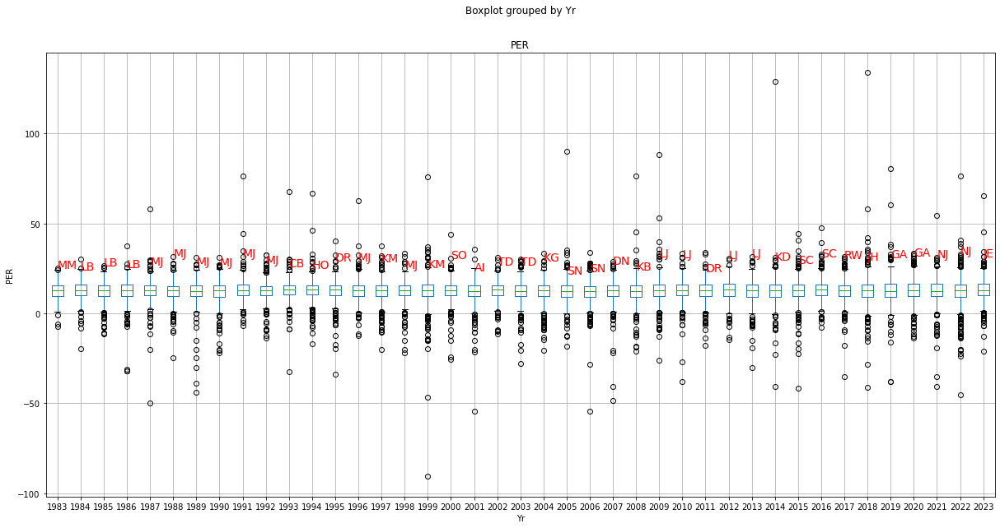
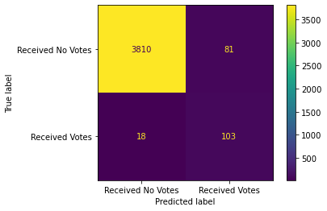
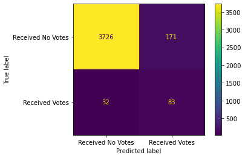
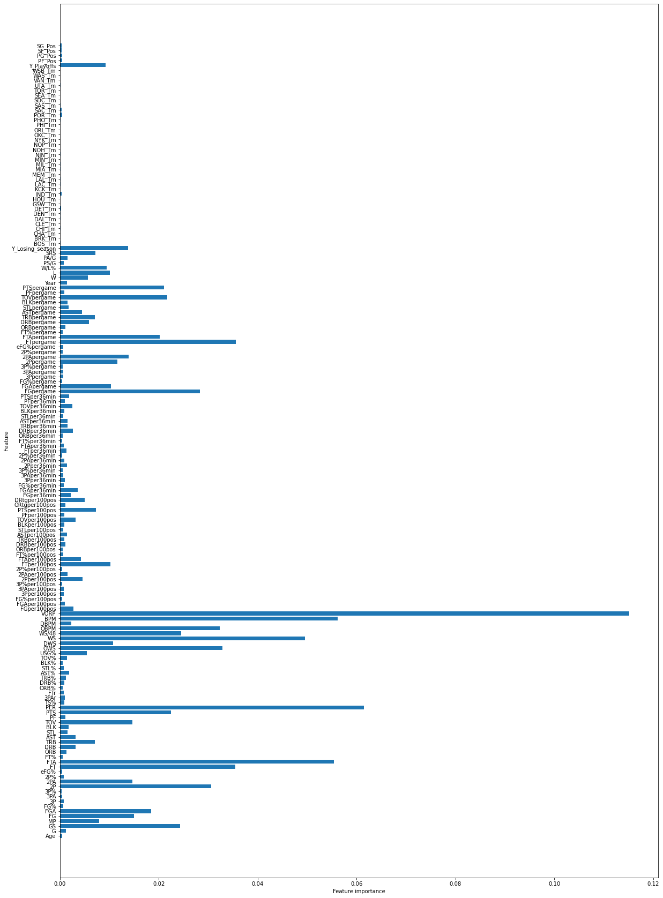
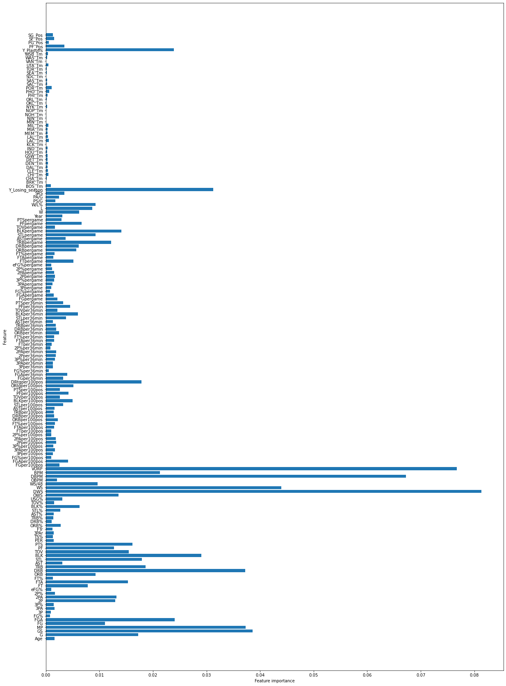

# NBA-Accolades-Analysis


### Overview




My project submission seeks to analyze the objectivity of the NBA's yearly award selections - specifically for Most Valuable Player (MVP) and Defensive Player of the year (DPOY). Since these awards are voted on by members of the media, there is a subjective component to the selection process. I am interested to see how closely yearly MVP and DPOY selections align with top performers in various statistical categories. Ultimately I will use a consolidated NBA dataset to build a classification model that learns from past selections to make predictions for future selections.

### Reproducibility

This respository relies on data sourced (web-scraped) from Basketball-Reference.com. You can access CSV files of the data by navigating to the "Files" folder in this respository. Python code within the Jupter Notebook will allow you to access these files directly if you simply clone this respository.

I've also created an interactive Data Studio dashboard that further supplements my EDA. This dashboard uses the same underlying data and can be found here: https://lookerstudio.google.com/u/0/reporting/20dedf6d-08f4-438f-b041-0b65680f3b06/page/M5iYD


### Domain Knowledge

Basketball-Reference.com has been an extremely helpful resource in the making of this project. The website not only includes a plethora of historical NBA data, but it also has explanations about stats, their origins, and their calculations. I've included a table in the Jupyter Notebook that provides this detail.

### Business And Data Understanding

My stakeholder for this project is the National Basketball Association (NBA). Up to this point, there has been little to no transparency offered into the yearly accolade selection process. I feel the NBA has a major opportunity to more clearly-define the accolade selection criteria. In order to help facilitate this process, I will analyze which features have been most important to predicting MVP and DPOY selections historically via classification modeling. The NBA can use this information along with future model predictions to not only establish a selection criteria, but also to supplement media voting with statistical backing.

The dataset I will be using for this analysis contains seasonal player data sourced from Basketball-Reference.com. The consolidated dataset contains over 20,000 rows anad 140 columns. These columns consist of various statistics (totals, per game, per 36 minutes, per 100 possessions, etc.) and the target variables will be "Rank-MVP" and "Rank-DPOY" transformed into categories (Won, Received Votes, Received No Votes).

I started my data exploration by looking at the dataset's features. There were a few categorical features (Team, Position, Playoffs) with the remaining features being all continuous. Many of the continuous variables were very highly correlated to one another due to the nature of their calculations - some of them used one or a few of the same underlying variables, and some were essentially the same stat just for a different time period (i.e. Points per game vs. Points per 36 minutes). Despite this, I still wanted to include a breadth of information to give the model more data points to learn from. Ultimately this was not an issue as I used a classification model instead of a regression one.


I next sought to understand how the dataset's features related to the target variables. I looked into the most highly-correlated features to "Rank-MVP" and "Rank-DPOY" and later supplemented this correlation analysis with feature importances from my final model.

### Data Pre-Processing

I took the following data cleaning steps to prepare for modeling:
- Removed special characters from player names
- Replaced Team = "TOT" or Total rows with most recent team names for players traded mid-season
- Mapped team name abbreviations accordingly to enable table joining
- Joined seasonal player tables with seasonal team tables with season MVP and DPOY voting tables
- One-Hot-Encoded categorical variables
- Replaced continuous variable null values with 0s after further exploration
- Created new, categorical target variables based on "Rank-MVP" and "Rank-DPOY"

With my newly-cleaned dataset, I conductd Exploratory Data Analysis (EDA) to get a better sense for trends in the data. My EDA included plotting time series graphs, measures of central tendancy (box-and-whisker), and scatter plots.










### Modeling Approach

I started my modeling process by splitting the cleaned dataset into Train and Test sets. For my baseline model - I built a multli-class Decision Tree Classifier that produced a Train Accuracy score of 100% and a Test Accuracy Score of 65% which suggested overfitting. Within the Test set classification report, I also noticed that the model performed much better on the majority class than the minority classes due to class imbalance. 

I took the following steps to iterate on my baseline model:
- Conducted SMOTE resampling to address class imbalance
- Incorporated hyperparameter tuning to address overfitting
- Changed dataset from multi-class to binary
- Tested Random Forest Classifiers and compared performance to that of Decision Tree Classifiers


### Modeling Results

MVP Voting Predictions:
* Baseline multi-class DTC: Test Macro Average F1-Score = 65%
* Multi-class DTC with SMOTE Resampling: Test Macro Average F1-Score = 70%
* Multi-class DTC with SMOTE Resampling and Hyperparameter Tuning: Test Macro Average F1-Score = 71%
* Multi-class RFC with SMOTE Resampling and Hyperparameter Tuning: Test Macro Average F1-Score = 74%
* Binary RFC with SMOTE Resampling and Hyperparameter Tuning: Test Macro Average F1-Score = 83%



DPOY Voting Predictions:
* Binary RFC with SMOTE Resampling and Hyperparameter Tuning: Test Macro Average Accuracy = 71%



### Conclusion

Ultimately I was able to produce the best predictive classification results with the Binary Random Forest Classifier with SMOTE resampling and hyperparameter tuning. This model showed the best balance in prediction scores between classes, although it still performed much better on the majority class than it did on the minority class. This is to be expected though, and is the nature of making predictions on hundreds of players in a season with only very few award votes.

My model also revealed the following to be the 5 most important features for predicting MVP voting:
- Value Over Replacement Player (VORP)
- Player Efficiency Rating (PER)
- Box Plus Minus (BPM)
- Win Shares (WS)
- Free Throw Attemps (FTA)



It revealed the following for DPOY voting:
- Defensive Win Share (DWS)
- Value Over Replacement Player (VORP)
- Defensive Box Plus Minus (DBPM)
- Win Shares (WS)
- Games Started (GS)



Although there is some overlap between the two models in top 5 feature importances, we do start to see more distinction within the top 10, 15, and 20. 

My recommendation to the NBA is to use both predictions and feature importances from these two models to form the basis of its objective voting criteria. With a more concrete statistical framework in place for each yearly accolade, the NBA can provide more transparency to fans, players, and media about which players should be considered for each award and why. Media voting members can then overlay narrative distinctions to supplement the statistical analysis.

In addition to solidifying objective criteria, the NBA also has an opportunity to define subjective criteria. For example players coming back from serious injuries, players who demonstrated outstanding leadership qualities, etc. Maintaining some level of subjectivity but more clearly defining the criteria will keep yearly voting fun and interesting. My belief is that fans are interested in both stats and narrative at the end of the day.


## Repository Structure
```
├── Files <- Webscraped raw datasets
├── Images <- Data visualizations
├── NBA-Accolades.ipynb <- Narrative documentation of analysis in Jupyter notebook
├── Presentation.pdf <- PDF version of project presentation
├── README.md <- The top-level README for reviewers of this project
├── Requirements.txt <- Deployment requirements for reproducibility

